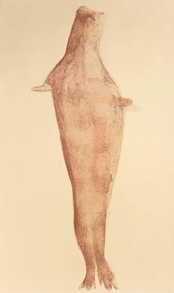
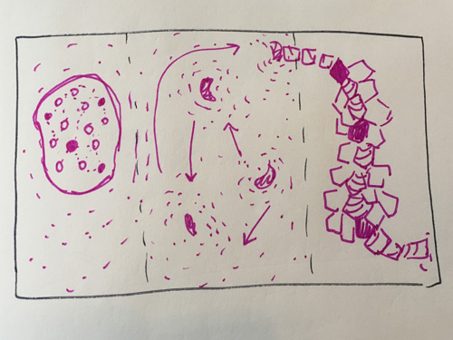

Robbe (Seal) by Joseph Beuys, 1983

## Workshop Goals

In this workshop, we will practice giving form to our ideas through both drawing and speaking. We will start at a point of self-reflection and then move on to thinking about the roles artists play in society.

**Objectives:** Explore roles that art can play in creating social change and examine your position as an artist

## Workshop Summary

_(5 min)_ Introduction to the workshop. Go over a summary of the workshop and hint at the objectives. For those who don't identify as artists outside of this class, you are an artist.

_(20 min)_ The first part of the workshop will be spent in a "ring discussion" (Ringgesprache), inspired by the ones that Josef Beuys' conducted while teaching at Düsseldorf Academy of Art. We'll have an open discussion on the role of art and artists in society. In order to spur conversation, specific questions will be touched upon as needed:
* Are you an artist? (Yes, I just told you that you are.)
* Is everyone really an artist?
* What does it mean for art to be accessible? What does that look like to you? Does it matter?
* Does being an artist give you more agency to intervene in society or the environment?
* At what scales is art able to impact society or the environment?
* What aspects/problems/parts of society are artists most equipped to deal with in their practice?

_(8 min)_ Using the topics and ideas discussed, each student will create a drawing that manifests his/her idea of his/her role as an artist in society. This can be fictional, aspirational, or idealized, but should be based in how you identify yourself. Society is a pretty big entity, so you can also imagine yourself engaging smaller societies like your neighborhood, the museum, ITP, etc. Your drawing can be literal or abstract. Visualize your idea in the way you see fit.

_(5 min each round as time allows)_ We will do an exquisite corpse by passing the original drawings along to each other several times. Each time the drawings are passed students will transform the previous based on Beuys' Theory of Sculpture. Each drawing should connect to the next one somehow. At the end, the drawings will return to the artist who started it.

_(movements)_
* expansion - contraction
* chaos	- order
* undetermined - determined
* organic - crystalline
* warm - cold

Why are we doing this? Through a transformations of ideas we can see other possibilities and what happens when an original idea grows beyond its initial conception.

_(10 min)_ At the end we will have a brief discussion about how we feel about the final drawings. After that, we will leave the classroom and find someone outside of the workshop to give our drawing. Students will try their best to explain the drawing to them with words.
